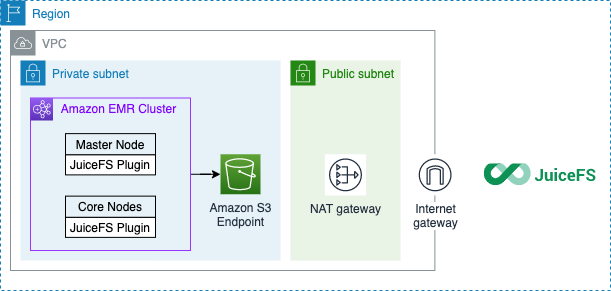
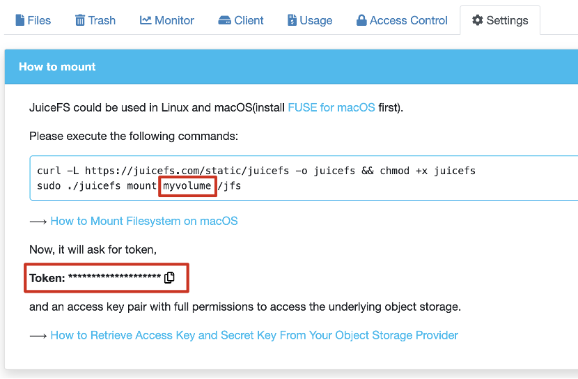

# Amazon EMR with JuiceFS QuickStart

[中文](./README.zh.md)

This is a quick start of using JuiceFS as storage backend for Amazon EMR cluster. [JuiceFS](https://juicefs.com/) is a POSIX-compatible shared filesystem specifically designed to work in the cloud that is compatible with HDFS. JuiceFS can save 50%~70% cost comparing with self managed HDFS while achieving equivalent performance as self managed HDFS.

This solutions also provide a TPC-DS benchmark sample to have a try. There's a `benchmark-sample.zip` file at your master node home directory of `hadoop` user.

TPC-DS is published by the Transaction Performance Management Committee (TPC), the most well-known standardization organization for benchmarking data management systems. TPC-DS uses a multidimensional data model such as star and snowflake. It contains 7 fact tables and 17 latitude tables with an average of 18 columns per table. Its workload contains 99 SQL queries covering the core parts of SQL99 and 2003 as well as OLAP. this test set contains complex applications such as statistics on large data sets, report generation, online query, data mining, etc. The data and values used for testing are skewed and consistent with the real data. It can be said that TPC-DS is a test set that is very close to the real scenario and is also a difficult test set.

## Architecture



> ⚠️ Notice
>
> 1. The Amazon EMR cluster needs to contact to JuiceFS Cloud. It needs a NAT Gateway to access public internet.
> 2. Each node of the Amazon EMR cluster needs to install JuiceFS hadoop extension to be able to use JuiceFS as storage backend
> 3. JuiceFS Cloud only store metadata. The orginal data is still stored in your account S3.

## Deploy Guide

### Prerequisites

1. [Register for a JuiceFS account](https://juicefs.com/accounts/register)

2. Create a volume on the [JuiceFS Console](http://juicefs.com/console/). Select your AWS account region and create a new volume. Please change the "Compressed" item to Uncompressed in "Advanced Options"

    > Note: JuiceFS file system enables lz4 algorithm for data compression by default. In big data analysis scenarios, ORC or Parquet file formats are often used, and only a part of the file needs to be read during the query process. If compression is enabled, the complete block must be read and decompressed to get the needed part, which will cause read amplification. If compression is turned off, you can read part of the data directly

    

3. Get the access token and volume name from the JuiceFS console

    

### Launch your stack

- Launch from AWS China Region [](https://console.amazonaws.cn/cloudformation/home#/stacks/quickcreate?templateUrl=https%3A%2F%2Faws-gcr-solutions.s3.cn-north-1.amazonaws.com.cn%2FAws-emr-with-juicefs-quickstart%2Flatest%2Femr-with-juicefs.template)
- Launch from AWS Global Region [](https://console.aws.amazon.com/cloudformation/home#/stacks/quickcreate?templateUrl=https%3A%2F%2Faws-gcr-solutions.s3.amazonaws.com%2FAws-emr-with-juicefs-quickstart%2Flatest%2Femr-with-juicefs.template)

Launch parameters

| Parameter Name          | Explanation                                                                                                          |
|-------------------------|----------------------------------------------------------------------------------------------------------------------|
| EMRClusterName          | EMR cluster name                                                                                                     |
| MasterInstanceType      | Master node instance type                                                                                            |
| CoreInstanceType        | Core Node Type                                                                                                       |
| NumberOfCoreInstances   | Number of core nodes                                                                                                 |
| JuiceFSAccessToken      | JuiceFS access token                                                                                                   |
| JuiceFSVolumeName       | JuiceFS volume name                                                                                          |
| JuiceFSCacheDir         | Local cache directory, you can specify multiple folders, separated by a colon : or use wildcards (e.g. *)           |
| JuiceFSCacheSize        | The size of the disk cache, in MB. If multiple directories are configured, this is the sum of all cache directories. |
| JuiceFSCacheFullBlock   | Whether to cache continuous read data, set to false if disk space is limited or disk performance is low              |

Launch AWS CloudFormation stack


Once you have finished deployment, you can check your cluster at EMR service


Goto hardware tab and find your master node


Connect to your master node by AWS Systems Manager Session Manager


Verify your JuiceFS environment

```shell
$ sudo su hadoop
## JFS_VOL is a pre-defined environment variable that points to the JuiceFS storage volume
$ hadoop fs -ls jfs://${JFS_VOL}/ # Don't forget the last "slash"
$ hadoop fs -mkdir jfs://${JFS_VOL}/hello-world
$ hadoop fs -ls jfs://${JFS_VOL}/
```

## Run TPC-DS benchmark

1. login to cluster master node by AWS Systems Manager Session Manager and then change current user to hadoop

    ```shell
    $ sudo su hadoop
    ```
2. unzip benchmark-sample.zip

    ```shell
    $ cd && unzip benchmark-sample.zip
    ```

3. Run tpcds benchmark

    ```shell
    $ cd benchmark-sample
    $ screen -L

    ## . /emr-benchmark.py is the benchmark test program
    ## It will generate the test data for the TPC-DS benchmark and execute a test set (from q1.sql to q10.sql)
    ## The test will contain the following parts.
    ## 1. generate TXT test data
    ## 2. convert TXT data to Parquet format
    ## 3. convert TXT data to Orc format
    ## 4. execute Sql test cases and count the time spent in Parquet and Orc format

    ## Supported parameters
    ## --engine                 Compute engine: hive or spark
    ## --show-plot-only         Shows plot in the console
    ## --cleanup, --no-cleanup  Whether to clear benchmark data on every test, default: no
    ## --gendata, --no-dendata  Whether to generate data on every test, default: yes
    ## --restore                Restore the database from existing data, this option needs to be turned on after --gendata
    ## --scale                  The size of the data set (e.g. 100 for 100GB of data)
    ## --jfs                    Enable on JuiceFS benchmark testing
    ## --s3                     Enable S3 benchmark test
    ## --hdfs                   Enable HDFS benchmark test

    ## Please make sure the model has enough space to store the test data, e.g. 500GB. m5d.4xlarge or above is recommended for Core Node.
    ## For model storage space choices, please refer to https://docs.aws.amazon.com/emr/latest/ManagementGuide/emr-plan-storage.html
    $ ./emr-benchmark.py --scale 500 --engine hive --jfs --hdfs --s3 --no-cleanup --gendata
    Enter your S3 bucket name for benchmark. Will create it if it doesn\'t exist: xxxx (Please enter the name of the bucket used to store the s3 benchmark data, if it does not exist, a new one will be created)

    $ cat tpcds-setup-500-duration.2021-01-01_00-00-00.res # result
    $ cat hive-parquet-500-benchmark.2021-01-01_00-00-00.res # result
    $ cat hive-orc-500-benchmark.2021-01-01_00-00-00.res # result

    ## Delete data
    $ hadoop fs -rm -r -f jfs://$JFS_VOL/tmp
    $ hadoop fs -rm -r -f s3://<your-s3-bucketname-for-benchmark>/tmp
    $ hadoop fs -rm -r -f "hdfs://$(hostname)/tmp/tpcds*"
    ```

    > ⚠️Note
    >
    > AWS Systems Manager Session Manager may time out and cause the terminal to disconnect, it is recommended to use the `screen -L` command to keep the session in the background
    > `screen` log will be saved to `screenlog.0`

    > ⚠️Note
    >
    > If the test machine has more than 10vcpu in total, you need to open JuiceFS Pro trial, for example: you may encounter the following error
    > `juicefs[1234] <WARNING>: register error: Too many connections`

    Sample output

    

## Building CDK projects from source code

1. Edit `.env` file according to your AWS environment
2. Create the bucket if not exists

    ```shell
    $ source .env
    $ aws s3 mb s3://${DIST_OUTPUT_BUCKET}/
    $ aws s3 mb s3://${DIST_OUTPUT_BUCKET_REGIONAL}/
    ```

3. Build

    ```shell
    $ cd deployment
    $ ./build-s3-dist.sh ${DIST_OUTPUT_BUCKET} ${SOLUTION_NAME} ${VERSION}
    ```

4. Upload s3 assets

    ```shell
    $ cd deployment
    $ aws s3 cp ./global-s3-assets/ s3://${DIST_OUTPUT_BUCKET}/${SOLUTION_NAME}/${VERSION} --recursive
    ```

5. CDK Deploy (Make sure you have CDK bootstraped)

    ```shell
    $ cd source
    $ source .env
    $ npm run cdk deploy  -- --parameters JuiceFSAccessToken=token123456789 --parameters JuiceFSBucketName=juicefs-bucketname --parameters EMRClusterName=your-cluster-name
    ```

## Building Project Distributable

1. Edit `.env` file according to your AWS environment
2. Create the bucket if not exists

    ```shell
    $ source .env
    $ aws s3 mb s3://${DIST_OUTPUT_BUCKET}/
    $ aws s3 mb s3://${DIST_OUTPUT_BUCKET_REGIONAL}/
    ```

3. Build the distributable

    ```shell
    $ cd deployment
    $ ./build-s3-dist.sh ${DIST_OUTPUT_BUCKET} ${SOLUTION_NAME} ${VERSION}
    ```

4. Deploy your solution to S3

    ```shell
    $ cd deployment
    $ aws s3 cp ./global-s3-assets/ s3://${DIST_OUTPUT_BUCKET}/${SOLUTION_NAME}/${VERSION} --recursive
    $ aws s3 cp ./regional-s3-assets/ s3://${DIST_OUTPUT_BUCKET_REGIONAL}/${SOLUTION_NAME}/${VERSION} --recursive
    ```

5. Get the link of the solution template uploaded to your Amazon S3 bucket.
6. Deploy the solution to your account by launching a new AWS CloudFormation stack using the link of the solution template in Amazon S3.

***

Copyright 2021 Amazon.com, Inc. or its affiliates. All Rights Reserved.

Licensed under the Apache License Version 2.0 (the "License"). You may not use this file except in compliance with the License. A copy of the License is located at

    http://www.apache.org/licenses/

or in the "license" file accompanying this file. This file is distributed on an "AS IS" BASIS, WITHOUT WARRANTIES OR CONDITIONS OF ANY KIND, express or implied. See the License for the specific language governing permissions and limitations under the License.
